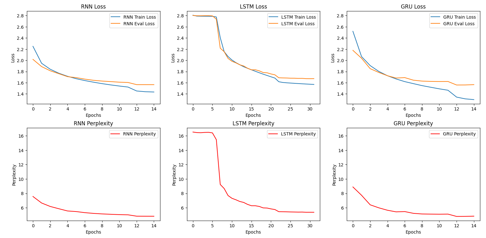
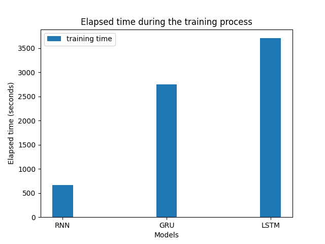

# RNN Implementation in PyTorch
## Comparing Efficiency: RNN vs LSTM vs GRU
### Generating Text based on Dante's Divina Commedia

## Table of Contents
- [Introduction](#Introduction)
- [Usage](#Usage)
- [Structure](#Structure)
- [Theory](#Theory)

## Introduction
This repository contains the implementation of a Recurrent Neural Network (RNN) using PyTorch. The main goal of this project is to compare the efficiency of different RNN variants, namely LSTM (Long Short-Term Memory) and GRU (Gated Recurrent Unit), in generating a text based on Dante's Divina Commedia.

## Usage
To get started, first open up a terminal and clone the project repository
```
git clone https://github.com/MatteoFalcioni/pattern_recognition.git
```

Then, you will need to install PyTorch by running the command
```
pip install torch
```

To train the model or to generate text from it, simply run ```RNN.py``` and specify relevant command line arguments. The [possible arguments](https://github.com/MatteoFalcioni/pattern_recognition/blob/51d8459fb33a9cc0d4d33f660cab349632f86242/data_config.py#L68) are: 
- ```--MODEL``` or ```-m``` which specifies the chosen model;
- ```--CONFIG``` or ```-c``` which specifies the configuration file path containing the model's hyperparameters;
- ```--TRAINING``` or ```-t``` which specifies whether the model is going to be trained or if it will be used only for inference;
- ```--SAVING``` or ```-s``` which specifies whether the trained model's parameters should be saved for future usage or discarded. 

For example, to run training using one of the provided configuration file in the [configuration](configuration) folder, run the following in the terminal:
```
python RNN.py -c configuration\config_LSTM.txt -m LSTM -t train -s discard
```

If you want to plot the stored training data in the [toplot](toplot) folder, simply run `plot.py`

To show you some results: these are the plots of the losses and the perplexities after training, and the elapsed time during trainings:





And this is the sampled text from the RNN vs LSTM vs GRU after training, with the prompt sequence "nel mezzo del cammin di nostra vita": 

RNN: "nel mezzo del cammin di nostra vita nome disprai seme dispienge rimaliggiar di questa parer trasmetto poco i mudai son laisi per luci latto averava i pace porregui del ciel potea per uscimisse e sacque sovera questo si dimmi gristond io rovi chi miei simira e vidi voisami volte inver"

LSTM: "nel mezzo del cammin di nostra vita fighio ul seglar dira sframa o facea come l sovra disse a solmegi vadirli le bostar l anima intinte già cèlò raggia a frate farame queste rivuge e io leda e non li occhi stinifani in foco forcando in suso a viso esser la scende qui per la gropio la "

GRU: "nel mezzo del cammin di nostra vita di che tante più dal lungi vien corto son a muover li altra spondavetti di lui creatura lì haemo e disse verdimiso la passo presando venuto l poco era vedea tutt d annostra laggio la termava l alpe a lunga sovra di sotto tal un tolo dritto raccoflor"

## Structure
This is how the project has been divided into blocks: 
- In the [configuration](configuration) folder there are the hyperparameters to configurate the models.
- In the [pretrained](pretrained) folder you can find pretrained models to use for inference, without needing to go through training.
- In the file [models.py](models.py) there are the RNN, LSTM and GRU class definitions. 
- The file [data_config.py](data_config.py) contains some utility functions for data configuration and data preprocessing.
- The file [training.py](training.py) contains the training and validation functions, and the inference function to generate text.
- The file [RNN.py](RNN.py) is the main script; here datasets are instantiated and training and inference are run.
- In the file [plot.py](plot.py) there is the script to plot the results, which are contained in the [toplot](toplot) repository and rewritten after training.
- In the file [testing.py](testing.py) I have put all the testing I have done. The data used for testing are stored in the [test_data](test_data) folder.

## Theory
Recurrent Neural Networks (RNNs) are a class of neural networks that are well-suited for sequential data, such as text. They have the ability to retain information from previous steps and use it to make predictions or generate new sequences. In this project, we explore the effectiveness of RNNs by comparing two popular variants: LSTM and GRU. To evaluate the performance of LSTM and GRU models, we train them on a dataset consisting of Dante's Divina Commedia. The models are then used to generate text that resembles the style and language of the original work.
To understand the structure of an RNN, let’s consider a basic one-layer RNN with a single “recurrent unit”. At each time step $t$, the network receives an input vector $x(t)$ and produces an output vector $y(t)$. Additionally, the network maintains a hidden state vector $h(t)$, which acts as a memory that encodes information from past time steps. 
The recurrent connection in an RNN is formed by connecting the hidden state from the previous time step $h(t − 1)$ to the current time step $t$. This connection allows the hidden state to influence the computation at the current time step, thus enabling the network to retain information about
past inputs. This process is called the "unfolding" of the RNN and is depicted in the image below.


The equations governing the RNN functioning can be summed up as:


Where $W$ represent the weight matrices for the differrent units, $\mathbf{b}$ and $\mathbf{c}$ are bias terms, $f$ denotes the activation function applied element-wise to the input of the recurrent unit and $g$ is the activation function applied to the output layer.

Unluckily, RNNs suffer from certain limitations (vanishing and exploding gradient issues) that can hinder their performance on tasks that involve long-term dependencies. These limitations motivated the developmentof more advanced architectures like Long Short-Term Memory (LSTM) network and Gated-Recurrent Units (GRU). 
A common LSTM unit is composed of a cell, an input gate, an output gate and a forget gate. The cell remembers values over arbitrary time intervals and the three gates regulate the flow of information into and out of the cell. Forget gates decide what information to discard from a previous state. Input gates decide which pieces of new information to store in the current state, using the same system as forget gates. Output gates control which pieces of information in the current state to output. 
In the equations below, matrices $W_{\alpha \beta}$ contain the weights of the input and recurrent connections, where the subscripts $\alpha ,\beta$ will be referring to weights for transitions from gate $\alpha$ to gate $\beta$, which could be input gate $i$, output gate $o$, the forget gate $f$ or the memory cell $c$. In the same way, $b_{\alpha \beta}$ will refer to biases for the layers, and $\sigma_\alpha$ will be the activation functions of the gates.


$\odot$ denotes the element-wise product and the subscript $t$ indexes the time step.
Here is a sketch of the LSTM architecture:


Finally, GRUs simplify the LSTM architecture by combining the forget and input gates into a single update gate. Additionally, they introduce a reset gate that determines how much of the previous hidden state should be forgotten. This simplification results in a more streamlined architecture with fewer parameters than LSTMs. The following are its equations: 


where $r_t, z_t, n_t$ are the reset, update, and new gates, respectively. $\sigma$ is the sigmoid function, and $\odot$ is the Hadamard product.

Here is a sketch of its architecture:


