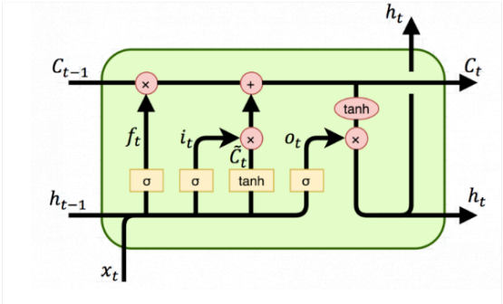
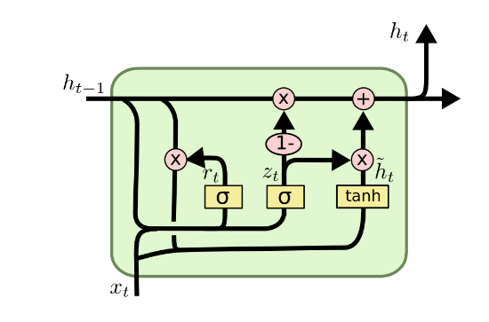

# RNN Implementation in PyTorch
## Comparing Efficiency: LSTM vs GRU
### Generating Text based on Dante's Divina Commedia
This repository contains the implementation of a Recurrent Neural Network (RNN) using PyTorch. The main goal of this project is to compare the efficiency of different RNN variants, namely LSTM (Long Short-Term Memory) and GRU (Gated Recurrent Unit), in generating text based on Dante's Divina Commedia.

## Table of Contents
- [Introduction](#introduction)
- [Installation](#installation)
- [Usage](#usage)
- [Results](#results)

## Introduction
Recurrent Neural Networks (RNNs) are a class of neural networks that are well-suited for sequential data, such as text. They have the ability to retain information from previous steps and use it to make predictions or generate new sequences. In this project, we explore the effectiveness of RNNs by comparing two popular variants: LSTM and GRU.

To evaluate the performance of LSTM and GRU models, we train them on a dataset consisting of Dante's Divina Commedia. The models are then used to generate text that resembles the style and language of the original work.

The architecture of an RNN is characterized by recurrent connections, which form a directed cycle in the network, allowing information to be circulated and preserved across different time steps. These connections enable RNNs to process variable-length input sequences, making them flexible and adaptable to different data modalities. 

To understand the structure of an RNN, let’s consider a basic one-layer RNN with a single “recurrent unit”. At each time step $t$, the network receives an input vector $x(t)$ and produces an output vector $y(t)$. Additionally, the network maintains a hidden state vector $h(t)$, which acts as a memory that encodes information from past time steps. 
The recurrent connection in an RNN is formed by connecting the hidden state from the previous time step $h(t − 1)$ to the current time step $t$. This connection allows the hidden state to influence the computation at the current time step, thus enabling the network to retain information about
past inputs. This process is called the ''unfolding `` of the RNN and is depicted in the image below.

The equations governing the RNN functioning can be summed up as:

$$\mathbf{h}(t) = f (\mathbf{W}_{xh}\mathbf{x}(t) + \mathbf{W}_{hh}\mathbf{h}(t-1) + \mathbf{b})$$

$$\mathbf{y}(t) = g(\mathbf{W}_{hy} \mathbf{h}(t) + \mathbf{c})$$

Unlickily, RNNs suffer from certain limitations (vanishing and exploding gradient issues) that can hinder their performance on tasks that involve long-term dependencies. These limitations motivated the developmentof more advanced architectures like Long Short-Term Memory (LSTM) network and Gated-Recurrent Units (GRU). 

A common LSTM unit is composed of a cell, an input gate, an output gate and a forget gate. The cell remembers values over arbitrary time intervals and the three gates regulate the flow of information into and out of the cell. Forget gates decide what information to discard from a previous state. Input gates decide which pieces of new information to store in the current state, using the same system as forget gates. Output gates control which pieces of information in the current state to output. 

In the equations below, matrices $W_{\alpha \beta}$ contain the weights of the input and recurrent connections, where the subscripts $\alpha ,\beta$ will be referring to weights for transitions from gate $\alpha$ to gate $\beta$, which could be input gate $i$, output gate $o$, the forget gate $f$ or the memory cell $c$. In the same way, $b_{\alpha \beta}$ will refer to biases for the layers, and $\sigma_\alpha$ will be the activation functions of the gates.

$$i_t = \sigma_i (W_{ii} x_t + b_{ii} + W_{hi} h_{t-1} + b_{hi})$$
$$f_t = \sigma_f (W_{if} x_t + b_{if} + W_{hf} h_{t-1} + b_{hf})$$
$$\Tilde{c}_t = \sigma_c (W_{ic} x_t + b_{ic} + W_{hc} h_{t-1} + b_{hc})$$
$$o_t = \sigma_o (W_{io} x_t + b_{io} + W_{ho} h_{t-1} + b_{ho})$$
$$c_t = f_t \odot c_{t-1} + i_t \odot \Tilde{c}_t$$
$$h_t = o_t \odot \sigma_h (c_t)$$

The initial values are $c_0=0$ and $h_0=0$ and the operator $\odot$ denotes the element-wise product. The subscript $t$ indexes the time step.
Here is a sketch of the LSTM architecture:

Finally, GRUs simplify the LSTM architecture by combining the forget and input gates into a single update gate. Additionally, they introduce a reset gate that determines how much of the previous hidden state should be forgotten. This simplification results in a more streamlined architecture with fewer parameters than LSTMs. The following are its equations: 

$$r_t = \sigma_f (W_{ir} x_t + b_{ir} + W_{hr} h_{t-1} + b_{hr})$$
$$z_t = \sigma (W_{iz} x_t + b_{iz} + W_{hz} h_{t-1} + b_{hz})$$
$$n_t = \tanh (W_{in} x_t + b_{in} + r_t \odot (W_{hn} h_{t-1} + b_{hn})$$
$$h_t = (1 - z_t) \odot n_t + z_t \odot h_{t-1}$$

and here is a sketch of its architecture:

**Installation**
1. Clone the repository:

git clone https://github.com/yourusername/yourprojectname.git

