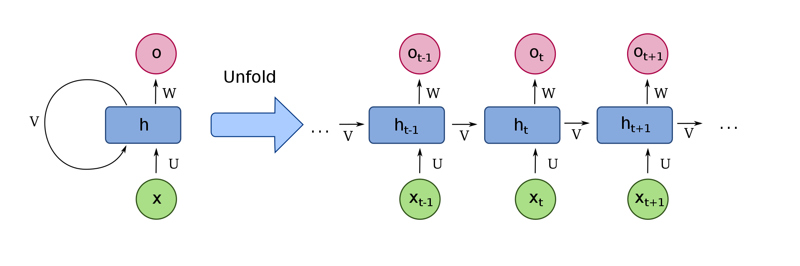

# RNN Implementation in PyTorch
## Comparing Efficiency: RNN vs LSTM vs GRU
### Generating Text based on Dante's Divina Commedia
This repository contains the implementation of a Recurrent Neural Network (RNN) using PyTorch. The main goal of this project is to compare the efficiency of different RNN variants, namely LSTM (Long Short-Term Memory) and GRU (Gated Recurrent Unit), in generating text based on Dante's Divina Commedia.

## Table of Contents
- [Introduction](#Introduction)
- [Usage](#Usage)
- [Project structure](#Project_structure)

## Introduction
Recurrent Neural Networks (RNNs) are a class of neural networks that are well-suited for sequential data, such as text. They have the ability to retain information from previous steps and use it to make predictions or generate new sequences. In this project, we explore the effectiveness of RNNs by comparing two popular variants: LSTM and GRU. To evaluate the performance of LSTM and GRU models, we train them on a dataset consisting of Dante's Divina Commedia. The models are then used to generate text that resembles the style and language of the original work.

The architecture of an RNN is characterized by recurrent connections, which form a directed cycle in the network, allowing information to be circulated and preserved across different time steps. These connections enable RNNs to process variable-length input sequences, making them flexible and adaptable to different data modalities. 

To understand the structure of an RNN, let’s consider a basic one-layer RNN with a single “recurrent unit”. At each time step $t$, the network receives an input vector $x(t)$ and produces an output vector $y(t)$. Additionally, the network maintains a hidden state vector $h(t)$, which acts as a memory that encodes information from past time steps. 
The recurrent connection in an RNN is formed by connecting the hidden state from the previous time step $h(t − 1)$ to the current time step $t$. This connection allows the hidden state to influence the computation at the current time step, thus enabling the network to retain information about
past inputs. This process is called the ''unfolding `` of the RNN and is depicted in the image below.

The equations governing the RNN functioning can be summed up as:

Where $W$ represent the weight matrices for the differrent units, $\mathbf{b}$ and $\mathbf{c}$ are bias terms, $f$ denotes the activation function applied element-wise to the input of the recurrent unit and $g$ is the activation function applied to the output layer.

Unlickily, RNNs suffer from certain limitations (vanishing and exploding gradient issues) that can hinder their performance on tasks that involve long-term dependencies. These limitations motivated the developmentof more advanced architectures like Long Short-Term Memory (LSTM) network and Gated-Recurrent Units (GRU). 

A common LSTM unit is composed of a cell, an input gate, an output gate and a forget gate. The cell remembers values over arbitrary time intervals and the three gates regulate the flow of information into and out of the cell. Forget gates decide what information to discard from a previous state. Input gates decide which pieces of new information to store in the current state, using the same system as forget gates. Output gates control which pieces of information in the current state to output. 

In the equations below, matrices $W_{\alpha \beta}$ contain the weights of the input and recurrent connections, where the subscripts $\alpha ,\beta$ will be referring to weights for transitions from gate $\alpha$ to gate $\beta$, which could be input gate $i$, output gate $o$, the forget gate $f$ or the memory cell $c$. In the same way, $b_{\alpha \beta}$ will refer to biases for the layers, and $\sigma_\alpha$ will be the activation functions of the gates.

$\odot$ denotes the element-wise product and the subscript $t$ indexes the time step.
Here is a sketch of the LSTM architecture:

Finally, GRUs simplify the LSTM architecture by combining the forget and input gates into a single update gate. Additionally, they introduce a reset gate that determines how much of the previous hidden state should be forgotten. This simplification results in a more streamlined architecture with fewer parameters than LSTMs. The following are its equations: 

where $r_t, z_t, n_t$ are the reset, update, and new gates, respectively. $\sigma$ is the sigmoid function, and $\odot$ is the Hadamard product.

Here is a sketch of its architecture:

## Usage
You can use this program in two ways: 
* you can use a pretrained model, contained in the [pretrained](pretrained) folder, to generate text in the style of Dante's Divina Commedia. 
* or, you can train the model again and then generate text after. 

Once you have chosen your goal, in order to start the program you have to do the following steps after launching the file [RNN.py](RNN.py):

1. First, you can either use the default hyperparameters for the model contained in the file [configuration](configuration.txt) by typing 'default' in the command line, or eventually choose your own creating a new configuration file in the syntax of [configuration](configuration.txt). If you choose to do so, you have to specify the path to the new configuration file in the command line;
2. Second, you will be asked what model do you want to use. Choice is between RNN, LSTM or GRU;
3. Third, you will be asked if you want to train your model or use a [pretrained](pretrained) one to generate text. If you choose the first option, you must type 'train' in the command line, otherwise you should type 'generate'. During training, training loss and validation loss are printed at every epoch in order to check for overfitting. Such data are stored in the [toplot](toplot) folder; 

If training is chosen, after training you will be asked if you want to save the new learnt parameters and therefore overwrite the pretrained models'              parameters in the [pretrained](pretrained) folder. If you are satisfied with the result (i.e. the values of the training loss and the validation loss) then you should save your model in order to use it again. 

If you want to plot the stored data, you must launch the file [plot.py](plot.py). This will plot not only the losses and the perplexity but also the comparison between the efficiency of the three models (stored in the [efficiency](efficiency) file), which is based on computing the hamming distance and the cosine similarity between the generated text, by measuring the accuracy of the prediction on the validation set and the elapsed time in the training process. 

## Project Structure
This is how the project has been divided into blocks: 
- In the [configuration](configuration.txt) file there are the hyperparameters to configurate the model.
- In the file [models.py](models.py) there are the RNN, LSTM and GRU classes (LSTM and GRU inherit from RNN) and the DataLoader class. 
- In the file [TEST_RNN.py](TEST_RNN.py) I have put all the testing I have done.
- The file [RNN.py](RNN.py) contain the main part of the code
- In the file [plot.py](plot.py) there is the script to plot the results, which are contained in the [toplot](toplot) repository and rewritten after training. 
- in the [pretrained](pretrained) folder you can find pretrained models to use.

